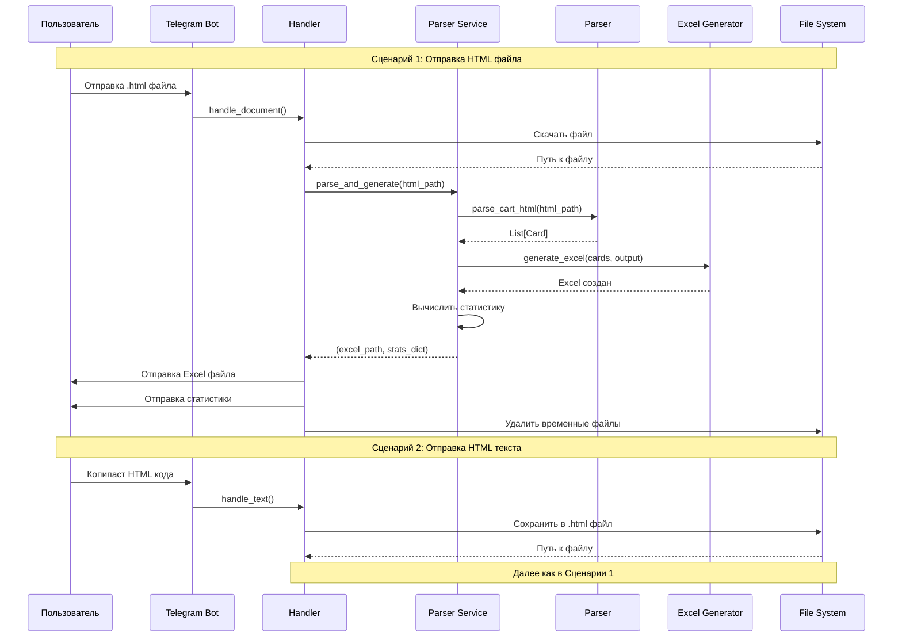

# 🤖 Telegram Bot Architecture для CardsOrder

## 📋 Оглавление

1. [Обзор системы](#обзор-системы)
2. [Архитектура](#архитектура)
3. [Workflow](#workflow)
4. [Структура проекта](#структура-проекта)
5. [Компоненты](#компоненты)
6. [Обработка ошибок](#обработка-ошибок)
7. [Развертывание](#развертывание)

---

## 🎯 Обзор системы

### Назначение

Telegram бот для автоматизации обработки заказов Card Kingdom:
- Принимает HTML код страницы корзины (текст или файл)
- Парсит данные о карточках MTG
- Генерирует Excel файл заказа
- Отправляет файл пользователю со статистикой

### Технологический стек

- **Python 3.9+**
- **python-telegram-bot 20.7+** - работа с Telegram API
- **Существующая кодовая база** - [`parser.py`](../src/parser.py), [`excel_generator.py`](../src/excel_generator.py)
- **Systemd** - автозапуск на сервере
- **Яндекс Облако** - хостинг

### Основные требования

✅ Поддержка двух форматов ввода (текст и файл)
✅ Статистика заказа в сообщении
✅ Обработка ошибок с понятными сообщениями
✅ Автоматическая очистка временных файлов
✅ Автозапуск через systemd
✅ Логирование всех операций

---

## 🏗️ Архитектура

### Компонентная диаграмма

```mermaid
graph TB
    subgraph "Telegram"
        U[Пользователь]
    end
    
    subgraph "Bot Layer"
        TB[bot.py<br/>Application]
        BH[bot_handlers.py<br/>Handlers]
    end
    
    subgraph "Service Layer"
        PS[bot_parser_service.py<br/>Parser Service]
    end
    
    subgraph "Existing Code"
        P[parser.py<br/>HTML Parser]
        EG[excel_generator.py<br/>Excel Generator]
        M[models.py<br/>Card Model]
    end
    
    subgraph "Storage"
        TMP[/tmp/cards-order-bot/<br/>Temp Files]
    end
    
    U -->|HTML текст/файл| TB
    TB --> BH
    BH --> PS
    PS --> P
    PS --> EG
    P --> M
    EG --> M
    PS -.->|read/write| TMP
    BH -.->|cleanup| TMP
    BH -->|Excel + Stats| U
    
    style TB fill:#90EE90
    style BH fill:#FFD700
    style PS fill:#FFB6C1
    style TMP fill:#D3D3D3
```

### Workflow диаграмма



---

## 📁 Структура проекта

```
CardsOrder/
├── src/                              # Существующий код (БЕЗ ИЗМЕНЕНИЙ)
│   ├── __init__.py
│   ├── models.py                    # Card model
│   ├── parser.py                    # HTML парсер
│   ├── excel_generator.py           # Excel генератор
│   ├── edition_fetcher.py
│   ├── cli.py
│   └── gui/
│
├── bot/                              # НОВАЯ ДИРЕКТОРИЯ для бота
│   ├── __init__.py
│   ├── bot.py                       # Главный файл, инициализация
│   ├── bot_handlers.py              # Обработчики команд и сообщений
│   ├── bot_parser_service.py        # Обертка над parser + excel_generator
│   │
│   ├── .env.example                 # Пример конфигурации
│   ├── requirements-bot.txt         # Зависимости бота
│   │
│   ├── ARCHITECTURE.md              # Архитектура (этот файл)
│   ├── README-bot.md                # Инструкции по использованию
│   ├── DEPLOYMENT.md                # Инструкции по развертыванию
│   │
│   ├── deploy_bot.sh                # Скрипт развертывания
│   ├── test_bot_local.py            # Локальное тестирование
│   │
│   └── systemd/
│       └── cards-order-bot.service  # Systemd unit файл
│
├── main.py                           # CLI (существующий)
├── main_gui.py                       # GUI (существующий)
├── requirements.txt                  # Основные зависимости
└── README.md                         # Общая документация
```

---

## 🔧 Компоненты

### 1. [`bot.py`](bot.py) - Главный файл

**Ответственность:**
- Инициализация Telegram Application
- Загрузка переменных окружения
- Настройка логирования
- Регистрация handlers
- Запуск polling

**Ключевые функции:**
```python
def main():
    """Точка входа бота"""
    # 1. Загрузка .env
    # 2. Настройка logging
    # 3. Создание temp директории
    # 4. Инициализация Application
    # 5. Регистрация handlers
    # 6. Запуск polling
```

**Зависимости:**
- `python-dotenv` - переменные окружения
- `telegram.ext.Application` - Telegram бот

### 2. [`bot_handlers.py`](bot_handlers.py) - Обработчики

**Ответственность:**
- Обработка команд `/start`, `/help`
- Обработка HTML файлов (`.html` documents)
- Обработка текстовых сообщений (HTML код)
- Формирование сообщений пользователю
- Очистка временных файлов

**Handlers:**

#### `start_command(update, context)`
- Приветствие пользователя
- Инструкция по использованию

#### `help_command(update, context)`
- Подробная справка
- Примеры использования
- FAQ

#### `handle_document(update, context)`
- Прием `.html` файлов
- Скачивание во временную директорию
- Вызов `bot_parser_service`
- Отправка Excel + статистика
- Cleanup

#### `handle_text(update, context)`
- Прием текстового HTML кода
- Сохранение в `.html` файл
- Вызов `bot_parser_service`
- Отправка Excel + статистика
- Cleanup

#### `error_handler(update, context)`
- Логирование ошибок
- Отправка понятных сообщений пользователю

**Обработка ошибок:**
```python
try:
    # Парсинг и генерация
except FileNotFoundError:
    # "Файл не найден"
except ValueError as e:
    # "Ошибка парсинга HTML"
except Exception as e:
    # "Неожиданная ошибка"
finally:
    # Cleanup временных файлов
```

### 3. [`bot_parser_service.py`](bot_parser_service.py) - Сервисный слой

**Ответственность:**
- Обертка над существующим кодом
- Координация [`parser.py`](../src/parser.py) и [`excel_generator.py`](../src/excel_generator.py)
- Вычисление статистики
- Генерация уникальных имен файлов

**Главная функция:**
```python
def parse_and_generate(html_path: str, output_dir: str) -> Tuple[str, Dict]:
    """
    Парсит HTML и генерирует Excel файл.
    
    Args:
        html_path: Путь к HTML файлу корзины
        output_dir: Директория для сохранения Excel
        
    Returns:
        Tuple[str, Dict]: (путь_к_excel, статистика)
        
    Raises:
        FileNotFoundError: Если HTML файл не найден
        ValueError: Если парсинг не удался
    """
    # 1. Вызвать parse_cart_html(html_path)
    # 2. Вызвать generate_excel(cards, output_path)
    # 3. Вычислить статистику
    # 4. Вернуть (excel_path, stats)
```

**Статистика:**
```python
{
    'total_cards': int,        # Количество уникальных карт
    'total_quantity': int,     # Общее количество
    'total_price': Decimal,    # Итоговая сумма
    'foil_count': int          # Количество фойлов
}
```

---

## ⚠️ Обработка ошибок

### Типы ошибок

| Ошибка | Причина | Сообщение пользователю |
|--------|---------|------------------------|
| `FileNotFoundError` | HTML файл не найден | ❌ Ошибка: Не удалось найти файл |
| `ValueError` | Невалидный HTML / пустая корзина | ❌ Ошибка парсинга: {детали} |
| `OSError` | Проблемы с записью Excel | ❌ Ошибка создания файла |
| `ConnectionError` | Проблемы с Telegram API | ⚠️ Временные проблемы с сетью |
| `Exception` | Любая другая ошибка | ❌ Неожиданная ошибка, попробуйте позже |

### Логирование

```python
# bot.py
logging.basicConfig(
    format='%(asctime)s - %(name)s - %(levelname)s - %(message)s',
    level=logging.INFO  # или DEBUG для verbose режима
)

# В handlers
logger.info(f"User {user_id} sent HTML file")
logger.error(f"Parsing failed: {e}")
```

---

## 🚀 Развертывание

### Переменные окружения (`.env`)

```bash
# Telegram Bot Token от @BotFather
BOT_TOKEN=1234567890:ABCdefGHIjklMNOpqrsTUVwxyz

# Временная директория для файлов
TEMP_DIR=/tmp/cards-order-bot

# Максимальный размер файла (25MB)
MAX_FILE_SIZE=26214400

# Уровень логирования (INFO, DEBUG, WARNING, ERROR)
LOG_LEVEL=INFO
```

### Systemd Service

**Файл:** `/etc/systemd/system/cards-order-bot.service`

```ini
[Unit]
Description=Cards Order Telegram Bot
After=network.target

[Service]
Type=simple
User=deploy_user
WorkingDirectory=/home/deploy_user/CardsOrder/bot
Environment="PATH=/home/deploy_user/CardsOrder/venv/bin"
EnvironmentFile=/home/deploy_user/CardsOrder/bot/.env
ExecStart=/home/deploy_user/CardsOrder/venv/bin/python bot.py
Restart=always
RestartSec=10

[Install]
WantedBy=multi-user.target
```

### Команды управления

```bash
# Запуск
sudo systemctl start cards-order-bot

# Остановка
sudo systemctl stop cards-order-bot

# Перезапуск
sudo systemctl restart cards-order-bot

# Автозапуск при загрузке
sudo systemctl enable cards-order-bot

# Просмотр логов
journalctl -u cards-order-bot -f
```

---

## 🔒 Безопасность

### Управление токенами

- ✅ Токен бота хранится в `.env` (не в git)
- ✅ `.env` добавлен в `.gitignore`
- ✅ Только `.env.example` в репозитории

### Временные файлы

- ✅ Уникальные имена файлов (UUID)
- ✅ Автоматическое удаление после обработки
- ✅ Ограничение размера файлов (25MB)
- ✅ Очистка при ошибках (try-finally)

### Валидация входных данных

- ✅ Проверка расширения файла (только `.html`)
- ✅ Проверка размера файла
- ✅ Проверка HTML структуры (через parser)

---

## 📊 Метрики и мониторинг

### Логируемые события

- Старт/остановка бота
- Получение файла/текста от пользователя
- Успешный парсинг (количество карт)
- Успешная генерация Excel
- Ошибки парсинга
- Отправка результата пользователю

### Пример лога

```
2025-11-30 12:00:00 - INFO - Bot started successfully
2025-11-30 12:01:15 - INFO - User 123456 sent HTML file (cart.html)
2025-11-30 12:01:17 - INFO - Successfully parsed 21 cards
2025-11-30 12:01:18 - INFO - Excel file generated: order_abc123.xlsx
2025-11-30 12:01:19 - INFO - Results sent to user 123456
```

---

## 🧪 Тестирование

### Локальное тестирование

```bash
# 1. Создать .env с тестовым токеном
cp .env.example .env
nano .env

# 2. Запустить бота
python bot.py

# 3. Протестировать в Telegram
# - Отправить /start
# - Отправить HTML файл
# - Отправить HTML текст
```

### Тестовые сценарии

1. **Успешный парсинг файла**
   - Отправить valидный HTML файл
   - Ожидается: Excel + статистика

2. **Успешный парсинг текста**
   - Отправить HTML код текстом
   - Ожидается: Excel + статистика

3. **Пустая корзина**
   - Отправить HTML без карт
   - Ожидается: Сообщение об ошибке

4. **Невалидный HTML**
   - Отправить поврежденный HTML
   - Ожидается: Понятное сообщение об ошибке

5. **Слишком большой файл**
   - Отправить файл >25MB
   - Ожидается: Предупреждение о размере

---

## 📚 Справочные материалы

### Существующий код

- [`src/parser.py`](../src/parser.py) - парсинг HTML корзины
- [`src/excel_generator.py`](../src/excel_generator.py) - генерация Excel
- [`src/models.py`](../src/models.py) - модель данных Card

### Референсный проект

- Stage4 Kara Project - Telegram бот для распознавания голосовых сообщений
- Архитектура, handlers, systemd setup

### Документация

- [python-telegram-bot](https://docs.python-telegram-bot.org/)
- [Telegram Bot API](https://core.telegram.org/bots/api)
- [Systemd Unit Files](https://www.freedesktop.org/software/systemd/man/systemd.service.html)

---

## ✅ Критерии готовности

- [x] Архитектура спроектирована
- [ ] Все компоненты реализованы
- [ ] Локальное тестирование пройдено
- [ ] Бот развернут на сервере
- [ ] Systemd service настроен
- [ ] Автозапуск работает
- [ ] End-to-end тест пройден
- [ ] Документация завершена

---

**Дата создания:** 2025-11-30  
**Версия:** 1.0  
**Статус:** В разработке