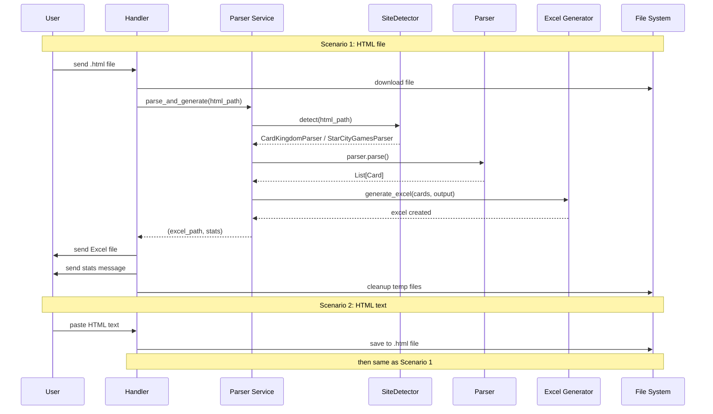

# Telegram Bot Architecture — CardsOrder

## Table of Contents

1. [System Overview](#system-overview)
2. [Architecture](#architecture)
3. [Project Structure](#project-structure)
4. [Components](#components)
5. [Error Handling](#error-handling)
6. [Deployment](#deployment)

---

## System Overview

### Purpose

Telegram bot that automates processing of MTG card orders from shopping carts:
- Accepts an HTML cart page (as a file or pasted text)
- Detects the website automatically (Card Kingdom, Star City Games)
- Parses card data (name, quantity, edition, condition, foil, price)
- Generates an Excel order file
- Sends the file back to the user with a summary

### Tech Stack

- **Python 3.9+**
- **python-telegram-bot 20.7+** — Telegram API
- **BeautifulSoup4 + lxml** — HTML parsing
- **openpyxl** — Excel generation
- **Systemd** — auto-start on server
- **Yandex Cloud** — hosting

### Supported Sites

| Site | Parser |
|------|--------|
| Card Kingdom (`cardkingdom.com`) | `CardKingdomParser` |
| Star City Games (`starcitygames.com`) | `StarCityGamesParser` |

---

## Architecture

### Component Diagram

```mermaid
graph TB
    subgraph "Telegram"
        U[User]
    end

    subgraph "Bot Layer — src/bot/"
        TB[bot.py\nApplication]
        BH[bot_handlers.py\nHandlers]
    end

    subgraph "Service Layer — src/"
        PS[parser_service.py\nParser Service]
        SD[site_detector.py\nSite Detector]
    end

    subgraph "Parsers — src/parsers/"
        BP[base_parser.py\nBaseCartParser]
        CK[card_kingdom_parser.py]
        SCG[starcitygames_parser.py]
    end

    subgraph "Shared — src/"
        EG[excel_generator.py]
        M[models.py\nCard]
    end

    subgraph "Storage"
        TMP[/tmp/cards-order-bot/\nTemp Files]
    end

    U -->|HTML file / text| TB
    TB --> BH
    BH --> PS
    PS --> SD
    SD --> CK
    SD --> SCG
    CK --> BP
    SCG --> BP
    BP --> M
    PS --> EG
    EG --> M
    PS -.->|read/write| TMP
    BH -.->|cleanup| TMP
    BH -->|Excel + stats| U

    style TB fill:#90EE90
    style BH fill:#FFD700
    style PS fill:#FFB6C1
    style SD fill:#ADD8E6
    style TMP fill:#D3D3D3
```

### Request Flow



---

## Project Structure

```
CardsOrder/
├── src/
│   ├── __init__.py
│   ├── models.py                     # Card dataclass
│   ├── base_parser.py                # Abstract base class for all parsers
│   ├── site_detector.py              # Detects site from HTML, returns parser
│   ├── parser.py                     # Thin wrapper: calls SiteDetector
│   ├── parser_service.py             # Orchestrates parse → Excel → stats
│   ├── excel_generator.py            # Writes Excel file
│   ├── edition_fetcher.py
│   ├── cli.py
│   │
│   ├── parsers/
│   │   ├── __init__.py
│   │   ├── card_kingdom_parser.py    # Card Kingdom HTML parser
│   │   └── starcitygames_parser.py   # Star City Games HTML parser
│   │
│   └── bot/
│       ├── __init__.py
│       ├── bot.py                    # Entry point: init Application, start polling
│       └── bot_handlers.py           # Command and message handlers
│
├── bot/                              # Deployment artifacts only
│   ├── .env.example
│   ├── .env.debug                    # Debug bot credentials (not in git)
│   ├── requirements-bot.txt
│   ├── deploy_bot.sh                 # Legacy release deploy script
│   ├── deploy_bot_debug.sh           # Deploy: debug (default) or --release
│   └── systemd/
│       ├── cards-order-bot.service         # Production systemd unit
│       └── cards-order-bot-debug.service   # Debug systemd unit
│
├── tests/
│   ├── fixtures/
│   │   ├── sample_cart.html
│   │   ├── sample_cart_scg.html
│   │   └── starcitygames_example.html
│   ├── test_parser.py
│   ├── test_scg_parser.py
│   ├── test_site_detector.py
│   └── test_excel_generator.py
│
├── docs/
│   └── ARCHITECTURE.md               # This file
│
├── main.py                           # CLI entry point
├── main_gui.py                       # GUI entry point
├── requirements.txt
├── requirements-dev.txt
└── README.md
```

---

## Components

### `src/bot/bot.py` — Entry Point

Responsibilities:
- Load environment variables from `.env`
- Configure logging
- Create temp directory
- Initialize Telegram `Application`
- Register handlers
- Start polling

### `src/bot/bot_handlers.py` — Handlers

| Handler | Trigger | Action |
|---------|---------|--------|
| `start_command` | `/start` | Welcome message with instructions |
| `help_command` | `/help` | Detailed help and FAQ |
| `handle_document` | `.html` file | Download → parse → send Excel |
| `handle_text` | Text message | Save as file → parse → send Excel |
| `error_handler` | Any exception | Log + send user-friendly message |

Dynamic output filename: `order_<site_slug>.xlsx` (e.g. `order_card_kingdom.xlsx`).

### `src/parser_service.py` — Service Layer

Single public function:

```python
def parse_and_generate(html_path: str, output_dir: str) -> Tuple[str, Dict]:
    """
    Returns: (excel_path, stats)
    stats keys: total_cards, total_quantity, total_price, foil_count, site_name
    """
```

Uses `SiteDetector` to pick the correct parser, then calls `excel_generator`.

### `src/site_detector.py` — Site Detector

```python
class SiteDetector:
    @staticmethod
    def detect(html_path: str) -> BaseCartParser:
        # Tries each registered parser's can_parse()
        # Raises ValueError("Could not determine the website...") if none match
```

Registered parsers (in priority order):
1. `CardKingdomParser`
2. `StarCityGamesParser`

### `src/base_parser.py` — Abstract Base

```python
class BaseCartParser(ABC):
    @property
    @abstractmethod
    def site_name(self) -> str: ...

    @classmethod
    @abstractmethod
    def can_parse(cls, soup: BeautifulSoup) -> bool: ...

    @abstractmethod
    def parse(self) -> List[Card]: ...
```

To add a new site: create a subclass, implement the three abstract members, register in `site_detector._PARSERS`.

---

## Error Handling

| Exception | Cause | User Message |
|-----------|-------|-------------|
| `FileNotFoundError` | HTML file missing | File not found |
| `ValueError("Could not determine...")` | Unknown/unsupported site | Site not supported |
| `ValueError` (other) | Empty cart / bad HTML | Parsing error with details |
| `OSError` | Excel write failed | File creation error |
| `Exception` | Anything else | Unexpected error, try again |

---

## Deployment

### Environment Variables (`.env`)

```bash
BOT_TOKEN=<token from @BotFather>
TEMP_DIR=/tmp/cards-order-bot
MAX_FILE_SIZE=26214400   # 25 MB
LOG_LEVEL=INFO           # DEBUG for verbose
```

### Servers

| Environment | Server | User | Service |
|-------------|--------|------|---------|
| Debug | `178.154.217.6` | `mbabaev` | `cards-order-bot-debug` |
| Production | `84.201.152.61` | `kara` | `cards-order-bot` |

### Deploy Scripts

```bash
# Deploy to debug server (default)
bash bot/deploy_bot_debug.sh

# Deploy to production
bash bot/deploy_bot_debug.sh --release
```

The script:
1. Creates a tar archive of `src/` + `bot/requirements-bot.txt` + `bot/systemd/`
2. Copies archive + `.env` to server via `scp`
3. Extracts, recreates venv, installs deps
4. Installs and (re)starts the systemd service

### Useful Commands

```bash
# View logs (debug)
ssh -i ~/.ssh/ssh-key-kara mbabaev@178.154.217.6 'sudo journalctl -u cards-order-bot-debug -f'

# Restart (debug)
ssh -i ~/.ssh/ssh-key-kara mbabaev@178.154.217.6 'sudo systemctl restart cards-order-bot-debug'

# View logs (production)
ssh -i ~/.ssh/kara_ssh_key kara@84.201.152.61 'sudo journalctl -u cards-order-bot -f'
```

---

**Created:** 2025-11-30
**Updated:** 2026-03-14
**Status:** Production
