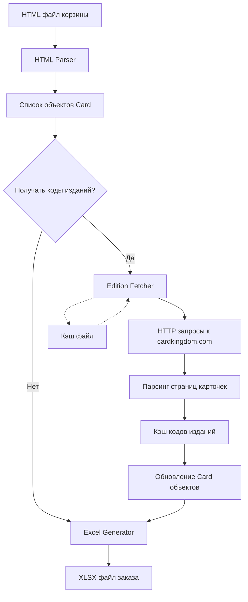

# План разработки: MTG Card Kingdom Order Parser

## Обзор проекта

Python-приложение для парсинга корзины Card Kingdom (MTG карточки) и генерации заказа в формате XLSX.

## Архитектура приложения

```
card-kingdom-parser/
├── src/
│   ├── __init__.py
│   ├── parser.py           # HTML парсер для извлечения данных о карточках
│   ├── models.py           # Модели данных (Card, Order)
│   ├── excel_generator.py  # Генератор XLSX файлов
│   ├── edition_fetcher.py  # Опционально: для получения кодов изданий
│   └── cli.py              # CLI интерфейс
├── tests/
│   ├── test_parser.py
│   ├── test_excel_generator.py
│   └── fixtures/
│       └── sample_cart.html
├── requirements.txt
├── README.md
└── main.py                 # Точка входа
```

## Детальный план разработки

### 1. Проектирование данных

#### Модель карточки (Card):
```python
@dataclass
class Card:
    quantity: int
    name: str                    # Название карты
    url: str                     # Полная ссылка на карточку
    is_foil: bool                # Фойл (ДА/НЕТ)
    condition: str               # Состояние (NM, EX, etc.)
    edition: str                 # Полное название издания
    edition_code: str | None     # Короткий код (BRO, MH3) - опционально
    price_per_unit: Decimal      # Цена за штуку
    total_price: Decimal         # Итого (вычисляемое)
    rarity: str                  # Редкость (C, U, R, M)
    variation: str | None        # Вариация (например, "1743 - Foil")
```

### 2. HTML-парсер (`parser.py`)

**Задачи:**
- Парсить HTML-файл корзины Card Kingdom
- Извлекать данные для каждой карточки из блоков `<div class="row cart-item-wrapper">`

**Ключевые элементы для извлечения:**
- Название: `<span class="title">`
- Издание: `<span class="edition">` (текст до скобок)
- Редкость: `<span class="edition">` (текст в скобках)
- Состояние: `<span class="style">`
- Количество: `:quantity` атрибут в `<lineitem-quantity-selector>`
- Цена за единицу: парсинг текста из `<small>` (паттерн: `($X.XX /ea)`)
- Фойл: проверка наличия `<div class="foil">`
- Ссылка: `href` из `<a class="product-link">`
- Вариация: извлечение из названия (например, "(1743 - Foil)")

**Технологии:**
- `BeautifulSoup4` для парсинга HTML
- `lxml` как парсер (быстрый и надежный)

### 3. Генератор Excel (`excel_generator.py`)

**Задачи:**
- Создавать XLSX файл с корректной структурой
- Форматировать колонки согласно шаблону
- Добавлять формулы для подсчета итоговых сумм

**Структура таблицы:**
| Колонка | Название | Тип данных |
|---------|----------|------------|
| A | Количество | Integer |
| B | Название карты | String |
| C | Ссылка | Hyperlink |
| D | Фойл | String (ДА/НЕТ) |
| E | Состояние | String |
| F | Издание | String |
| G | Цена за штуку (USD) | Decimal |
| H | Итого | Formula (=A*G) |

**Технологии:**
- `openpyxl` для работы с Excel файлами
- Форматирование: ширина колонок, выравнивание, форматы чисел

### 4. Опциональный модуль кодов изданий (`edition_fetcher.py`)

**Функциональность:**
- Делать HTTP-запросы к страницам карточек
- Извлекать короткий код издания из HTML страницы карточки
- Кэшировать результаты (один запрос на издание, а не на карточку)
- Обрабатывать ошибки сети

**Паттерн для извлечения:**
- Искать текст формата "BRO: Card Name" на странице карточки
- Использовать регулярное выражение для извлечения кода

**Технологии:**
- `requests` для HTTP-запросов
- `BeautifulSoup4` для парсинга
- Словарь для кэша: `{edition_full_name: edition_code}`

### 5. CLI интерфейс (`cli.py`)

**Команды:**
```bash
# Базовое использование
python main.py parse cart.html -o order.xlsx

# С извлечением кодов изданий
python main.py parse cart.html -o order.xlsx --fetch-edition-codes

# Только обновить коды изданий в существующем файле
python main.py update-editions order.xlsx
```

**Опции:**
- `--input` / `-i`: путь к HTML файлу корзины
- `--output` / `-o`: путь к выходному XLSX файлу
- `--fetch-edition-codes` / `-f`: флаг для получения кодов изданий
- `--verbose` / `-v`: детальный вывод прогресса

**Технологии:**
- `click` или `argparse` для CLI

### 6. Основной файл (`main.py`)

**Логика работы:**
1. Прочитать HTML-файл
2. Парсить содержимое и извлечь список карточек
3. Опционально: получить коды изданий
4. Сгенерировать Excel-файл
5. Сохранить результат

## Технологический стек

### Обязательные зависимости:
```
beautifulsoup4==4.12.2    # HTML парсинг
lxml==4.9.3               # XML/HTML парсер (быстрый)
openpyxl==3.1.2           # Работа с Excel
click==8.1.7              # CLI интерфейс
```

### Опциональные зависимости:
```
requests==2.31.0          # HTTP-запросы для кодов изданий
selenium==4.15.0          # Для будущей автоматизации браузера
```

## Этапы разработки

### Этап 1: MVP (Минимальный функционал)
- [x] Анализ требований
- [ ] Создание структуры проекта
- [ ] Реализация базового парсера HTML
- [ ] Создание модели данных Card
- [ ] Генератор простого Excel без форматирования
- [ ] Базовый CLI

### Этап 2: Полнофункциональная версия
- [ ] Улучшенное форматирование Excel
- [ ] Обработка ошибок и валидация данных
- [ ] Логирование процесса
- [ ] Тестирование на реальных данных

### Этап 3: Расширенные функции
- [ ] Модуль извлечения кодов изданий
- [ ] Кэширование кодов изданий в JSON-файле
- [ ] Прогресс-бар при обработке
- [ ] Статистика заказа (общая сумма, количество карт)

### Этап 4: Будущие улучшения (опционально)
- [ ] Автоматизация через Selenium
- [ ] GUI интерфейс (tkinter/PyQt)
- [ ] Экспорт в другие форматы (CSV, JSON)
- [ ] Группировка карт по изданиям

## Особенности реализации

### Парсинг HTML

**Структура HTML корзины:**
```html
<div class="row cart-item-wrapper">
    <a class="product-link" href="mtg/edition/card-name">
        <span class="title">Card Name</span>
        <span class="edition">Edition Name (R)</span>
        <span class="style">NM</span>
        <div class="foil"><small>FOIL</small></div>  <!-- Опционально -->
    </a>
    <span class="cart-item-price">$12.98</span>
    <small>($6.49 /ea)</small>
    <lineitem-quantity-selector :quantity="2">
</div>
```

**Стратегия парсинга:**
1. Найти все блоки `div.cart-item-wrapper`
2. Для каждого блока извлечь данные
3. Обработать специальные случаи:
   - HTML-сущности (`&#039;` → `'`)
   - Вариации в названиях (удалить из основного названия)
   - Цены с множественным количеством

### Генерация Excel

**Форматирование:**
- Шапка таблицы: жирный шрифт, заливка
- Числовой формат для цен: `$#,##0.00`
- Гиперссылки для колонки "Ссылка"
- Формулы для колонки "Итого": `=A2*G2`
- Автоширина колонок

**Валидация:**
- Проверка обязательных полей
- Проверка корректности цен (> 0)
- Проверка количества (> 0)

### Обработка ошибок

**Типы ошибок:**
- Файл не найден
- Неверный формат HTML
- Отсутствие обязательных элементов
- Проблемы с сетью (при получении кодов изданий)
- Ошибки записи Excel

**Стратегия:**
- Логирование всех ошибок
- Продолжение работы при ошибках отдельных карточек
- Отчет о пропущенных/проблемных карточках

## Пример использования

### Сценарий 1: Базовое использование
```bash
# Сохранить страницу корзины как cart.html
# Запустить парсер
python main.py parse cart.html -o my_order.xlsx

# Результат: my_order.xlsx с полными названиями изданий
```

### Сценарий 2: С кодами изданий
```bash
# Парсинг с получением кодов
python main.py parse cart.html -o my_order.xlsx --fetch-edition-codes

# Программа сделает дополнительные запросы и добавит коды BRO, MH3 и т.д.
```

### Сценарий 3: Обновление существующего файла
```bash
# Добавить коды изданий к существующему файлу
python main.py update-editions my_order.xlsx

# Программа прочитает файл, получит коды и обновит колонку
```

## Структура данных

### Промежуточное представление (JSON для отладки):
```json
{
  "cards": [
    {
      "quantity": 2,
      "name": "Lightning Bolt",
      "url": "https://www.cardkingdom.com/mtg/secret-lair/lightning-bolt-1743-foil",
      "is_foil": true,
      "condition": "NM",
      "edition": "Secret Lair",
      "edition_code": null,
      "price_per_unit": 4.99,
      "total_price": 9.98,
      "rarity": "R",
      "variation": "1743 - Foil"
    }
  ],
  "metadata": {
    "total_items": 41,
    "subtotal": 104.89,
    "parsed_at": "2025-11-16T19:00:00Z"
  }
}
```

## Обработка специальных случаев

### Вариации карт
- **Foil/Non-Foil**: извлекать из отдельного div или из названия
- **Borderless/Showcase**: сохранять в поле variation
- **Номерованные карты**: "(1743 - Foil)" → извлечь в variation

### Цены
- **Одна карта**: `$0.99` и `($0.99 /ea)` - совпадают
- **Несколько карт**: `$6.69` и `($2.23 /ea)` - использовать цену за единицу

### Издания
- **Полное название**: "Commander Legends: Battle for Baldur's Gate"
- **С редкостью**: "Commander Legends: Battle for Baldur's Gate (U)"
- **Очистка**: удалить редкость в скобках, оставить только название

### Ссылки
- **Относительные**: `mtg/edition/card-name`
- **Абсолютные**: добавить базовый URL `https://www.cardkingdom.com/`

## Расширенная функциональность (будущее)

### Фаза 2: Получение кодов изданий

**Алгоритм:**
1. Собрать уникальные издания из всех карт
2. Для каждого уникального издания:
   - Взять URL первой карты этого издания
   - Сделать HTTP-запрос
   - Парсить HTML страницы карточки
   - Искать паттерн `<edition_code>: <card_name>`
   - Сохранить в кэш
3. Применить коды ко всем карточкам

**Кэширование:**
- Сохранять в `edition_codes_cache.json`
- Формат: `{"The Brothers' War": "BRO", "Modern Horizons 3": "MH3"}`
- Использовать кэш при последующих запусках

**Оптимизация:**
- Параллельные запросы (asyncio + aiohttp)
- Ограничение скорости (rate limiting)
- Retry-логика для failed requests

### Фаза 3: Автоматизация браузера

**Функциональность:**
- Автоматический логин в Card Kingdom
- Переход на страницу корзины
- Извлечение HTML после загрузки AJAX
- Парсинг динамического контента

**Технологии:**
- Selenium WebDriver
- Playwright (альтернатива)

## Валидация и тестирование

### Тестовые сценарии:

1. **Корректный HTML с базовыми карточками**
   - Карточки без фойла
   - Разные состояния (NM, EX)
   - Разные количества

2. **Специальные случаи**
   - Фойловые карты
   - Карты с вариациями
   - Карты с длинными названиями изданий
   - HTML-сущности в названиях

3. **Граничные случаи**
   - Пустая корзина
   - Одна карточка
   - Много карточек (100+)
   - Невалидный HTML

4. **Негативные сценарии**
   - Отсутствующий файл
   - Поврежденный HTML
   - Отсутствие обязательных полей

## Зависимости проекта

```txt
# requirements.txt

# Обязательные
beautifulsoup4==4.12.2
lxml==4.9.3
openpyxl==3.1.2
click==8.1.7

# Опциональные (для расширенных функций)
requests==2.31.0
aiohttp==3.9.0  # для асинхронных запросов
selenium==4.15.0  # для автоматизации браузера

# Разработка
pytest==7.4.3
pytest-cov==4.1.0
black==23.12.0  # форматирование кода
mypy==1.7.0  # проверка типов
```

## CLI интерфейс

### Команды и опции:

```bash
# Основная команда: parse
python main.py parse <input_html> [OPTIONS]

OPTIONS:
  -o, --output PATH          Путь к выходному XLSX файлу [по умолчанию: order.xlsx]
  -f, --fetch-codes          Получить коды изданий с сайта
  -c, --cache PATH           Путь к файлу кэша кодов изданий
  -v, --verbose              Подробный вывод
  --no-formulas             Не использовать формулы, вычислить значения
  --help                    Показать справку

# Дополнительная команда: update-editions
python main.py update-editions <input_xlsx> [OPTIONS]

OPTIONS:
  -c, --cache PATH           Путь к файлу кэша кодов изданий
  -v, --verbose              Подробный вывод
  --help                    Показать справку
```

### Вывод в консоль:

```
Parsing cart HTML...
Found 41 items in cart

Processing cards: 100%|████████████| 41/41 [00:00<00:00]

Generating Excel file...
✓ Excel file created: order.xlsx

Summary:
  Total items: 41
  Total value: $104.89
  Foil cards: 4
  Unique editions: 15
```

## Примеры кода

### Пример парсинга одной карточки:

```python
def parse_card_item(item_div: Tag) -> Card:
    """Парсит один блок карточки из HTML"""
    
    # Извлечение базовых данных
    link = item_div.find('a', class_='product-link')
    title = link.find('span', class_='title').text.strip()
    
    # Издание и редкость
    edition_span = link.find('span', class_='edition').text.strip()
    edition_match = re.match(r'(.+?)\s*\(([CURMSL])\)', edition_span)
    edition = edition_match.group(1) if edition_match else edition_span
    rarity = edition_match.group(2) if edition_match else 'C'
    
    # Состояние
    condition = link.find('span', class_='style').text.strip()
    
    # Фойл
    is_foil = link.find('div', class_='foil') is not None
    
    # Количество
    quantity_selector = item_div.find('lineitem-quantity-selector')
    quantity = int(quantity_selector.get(':quantity', 1))
    
    # Цена за единицу
    price_small = item_div.find('small')
    price_match = re.search(r'\$([0-9.]+)\s*/ea', price_small.text)
    price_per_unit = Decimal(price_match.group(1))
    
    # URL
    href = link.get('href')
    url = f"https://www.cardkingdom.com/{href}"
    
    return Card(
        quantity=quantity,
        name=title,
        url=url,
        is_foil=is_foil,
        condition=condition,
        edition=edition,
        edition_code=None,
        price_per_unit=price_per_unit,
        total_price=price_per_unit * quantity,
        rarity=rarity,
        variation=None
    )
```

### Пример генерации Excel:

```python
def generate_excel(cards: list[Card], output_path: str):
    """Генерирует Excel файл из списка карточек"""
    wb = Workbook()
    ws = wb.active
    ws.title = "Лист1"
    
    # Заголовки
    headers = [
        "Количество",
        "Название карты",
        "Ссылка",
        "Фойл",
        "Состояние",
        "Издание",
        "Цена за штуку (USD)",
        "Итого:"
    ]
    ws.append(headers)
    
    # Данные
    for idx, card in enumerate(cards, start=2):
        ws.append([
            card.quantity,
            card.name,
            card.url,
            "ДА" if card.is_foil else "НЕТ",
            card.condition,
            card.edition_code or card.edition,
            float(card.price_per_unit),
            f"=A{idx}*G{idx}"  # Формула для итого
        ])
        
        # Гиперссылка
        ws[f'C{idx}'].hyperlink = card.url
        ws[f'C{idx}'].style = 'Hyperlink'
    
    # Форматирование
    format_worksheet(ws)
    
    wb.save(output_path)
```

## Решенные вопросы

1. ✅ **Источник данных**: Комбинированный подход - начинаем с HTML-файла, возможность добавить автоматизацию
2. ✅ **Коды изданий**: Опциональная функция с отдельными запросами (базовая версия использует полные названия)
3. ✅ **Сортировка**: Сохраняем порядок из корзины (order-preserving)
4. ✅ **Формат Excel**: Базовый набор полей согласно шаблону (без дополнительных полей)

## Mermaid диаграмма потока данных



## Детальный TODO список

Подробный список задач для реализации см. в файле [`TODO.md`](TODO.md:1)

## Следующие шаги

После утверждения плана переходим к реализации в режиме Code:
1. Создать структуру проекта
2. Настроить виртуальное окружение
3. Установить зависимости
4. Начать с реализации базового парсера
5. Протестировать на предоставленном HTML-файле